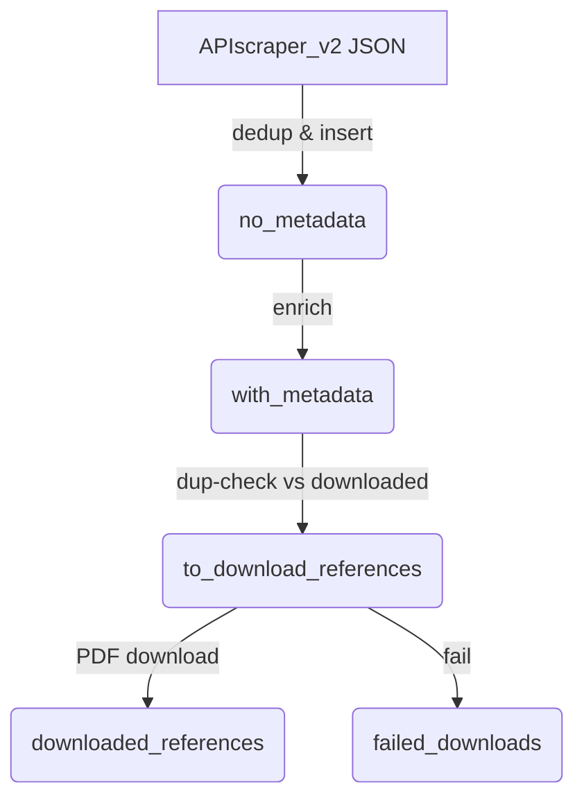

# Project Plan: `dl_lit` PDF Literature Pipeline

## 1. Project Overview

The goal of the `dl_lit` project is to create an automated, database-centric pipeline for processing academic PDFs. The pipeline starts with a PDF document, extracts its bibliography, enriches the reference metadata using external APIs (OpenAlex, Crossref), downloads the referenced papers, and stores all data and files in a structured way for future use and export.

## 2. Execution Environment

**IMPORTANT**: All `dl-lit` commands must be run from within the project's activated Python virtual environment. This ensures that the correct Python interpreter and all required dependencies are used.

```bash
# Example: Activating the virtual environment
source /path/to/your/venv/bin/activate

# Now you can run the commands
python -m dl_lit.cli init-db
```

## 3. Core Components & Scripts

This section documents the key Python scripts and their roles in the pipeline. It serves as a quick reference to prevent overlooking existing functionality.

- **`dl_lit/cli.py`**: The main entry point for all command-line operations. It uses the `click` library to define commands that orchestrate the different pipeline stages.

- **`dl_lit/db_manager.py`**: Contains the `DatabaseManager` class, which handles all interactions with the central SQLite database (`literature.db`). It manages the schema and all data transactions between the pipeline stages.

- **`dl_lit/get_bib_pages.py`**: Provides the `extract-bib-pages` CLI command. Its sole purpose is to identify and extract the specific pages containing the bibliography from a large source PDF, creating smaller, targeted PDFs for the next step.

- **`dl_lit/APIscraper_v2.py`**: **(Mistakenly overlooked previously)**. This script is responsible for the critical text extraction and parsing step. It takes the small, bibliography-only PDFs, sends them to a GenAI model (Gemini) to parse the text into structured JSON data, and then loads this data directly into the `no_metadata` table in the database.

- **`dl_lit/OpenAlexScraper.py`**: Contains the core logic for metadata enrichment. It takes entries from the `no_metadata` table and uses the OpenAlex and Crossref APIs to find comprehensive metadata, including authors, DOIs, and abstracts.

- **`dl_lit/new_dl.py`**: Contains the `BibliographyEnhancer` class, which is responsible for the final download stage: taking an enriched reference and attempting to find and download the corresponding PDF file.

## 3. End-to-End Workflow

This outlines the intended flow of data through the pipeline, from a single source PDF to a fully processed and downloaded set of references.

1.  **Start**: A user provides a source PDF (e.g., a handbook).
2.  **Extract Bib Pages**: `extract-bib-pages` command is run. It uses GenAI to find the reference sections and creates small PDFs containing only those pages.
3.  **Extract & Parse Text**: `APIscraper_v2.py` (via a future CLI command) processes these small PDFs. It uses GenAI to parse the references and inserts the structured data into the `no_metadata` table.
4.  **Enrich Metadata**: `enrich-openalex-db` command is run. It takes entries from `no_metadata`, fetches rich metadata from OpenAlex/Crossref, and on success, moves them to the `with_metadata` table.
5.  **Queue for Download**: `process-downloads` command is run. It moves entries from `with_metadata` to the `to_download_references` table, making them ready for download.
6.  **Download PDFs**: `download-pdfs` command is run. It processes the `to_download_references` queue, uses `new_dl.py` to find and save the PDF files, and moves the corresponding entries to the final `downloaded_references` table.

## 4. Current Task List

- [ ] **Fix Pipeline Crash**: Resolve the `ValueError` in `db_manager.py` that occurs during the `process-downloads` step.
    - [ ] Remove the redundant duplicate check from `add_entry_to_download_queue`.
- [ ] **Integrate `APIscraper_v2.py`**: Create a new CLI command in `cli.py` to properly run the `APIscraper_v2.py` logic as part of the main pipeline.
- [ ] **End-to-End Test**: Perform a full pipeline run on a sample PDF, using the newly integrated commands.
- [ ] **Documentation**: Update the main `README.md` to reflect the new commands and the complete, correct workflow.
- [ ] **Unit Tests**: Add unit tests for the downloader worker and the full pipeline integration.

## 1. Overall Goal

The `dl_lit` script aims to be a comprehensive tool for managing a personal academic literature database. Key functionalities include:
- **Initial import of existing literature from a BibTeX file into the main library.**
- Importing new references from various sources (JSON lists of identifiers).
- Fetching rich metadata for these references from online APIs (OpenAlex, Crossref, etc.).
- Downloading associated PDF files.
- Robust duplicate detection and management.
- Storing all information in a structured SQLite database.
- Exporting the curated library to BibTeX format.

## 2. Core Components/Modules

The new script will be designed with modularity in mind. Potential modules/classes:

*   **`DatabaseManager` (`db_manager.py`)**:
    *   Handles all SQLite database interactions.
    *   Manages schema creation and evolution for the four main tables:
        *   `downloaded_references` (master table for successfully processed entries)
        *   `to_download_references` (queue for entries pending download/processing)
        *   `duplicate_references` (log of entries identified as duplicates)
        *   `failed_downloads` (log of entries that failed processing)
    *   Provides CRUD operations and specialized query methods for each table.
    *   Handles transaction management.
    *   Implements and utilizes internal DOI normalization (`_normalize_doi`) for all DOI processing, ensuring consistent handling of different DOI formats (e.g., URL vs. bare) for reliable duplicate detection and storage.
    *   Supports initialization with an in-memory SQLite database (using `":memory:"`) for performance-critical operations (e.g., bulk BibTeX import).
    *   Includes a `save_to_disk()` method to persist an in-memory database to a disk file.

*   **`InputProcessor` (`input_processor.py`)**:
    *   Responsible for parsing and processing various input formats.
    *   **Handles BibTeX files for initial library import into `downloaded_references`. (Implemented and Verified)**
    *   Handles BibTeX files for checking against an existing library (populating `duplicate_references`).
    *   Handles JSON files (e.g., lists of DOIs, OpenAlex IDs, titles, or URLs to populate `to_download_references`).
    *   Could be extended for other formats (e.g., RIS, CSV) in the future.

*   **`MetadataFetcher` (`metadata_fetcher.py`)**:
    *   Fetches and normalizes metadata from external APIs:
        *   OpenAlex (primary, especially for its comprehensive linking)
        *   Crossref (good for DOI resolution and metadata)
        *   Semantic Scholar, arXiv API (as needed)
    *   Converts API responses into a standardized internal dictionary format.
    *   Uses Pydantic models for parsing structured API outputs where beneficial.
    *   Handles API rate limits and error responses gracefully.

*   **`PDFDownloader` (`pdf_downloader.py`)**:
    *   Manages the downloading of PDF files.
    *   Takes a URL (e.g., from `unpaywall`, `core.ac`, or direct links found in metadata).
    *   Handles HTTP requests, response validation, and saving files to a configured directory.
    *   Calculates PDF checksums (e.g., MD5/SHA256) for integrity and an additional duplication check vector.

*   **`DuplicateChecker` (`duplicate_checker.py`)**:
    *   (Note: Core duplicate checking logic, including the use of normalized DOIs and OpenAlex IDs via the `check_if_exists` method, is currently implemented within `DatabaseManager`. This section outlines planned responsibilities if a separate module is created.) Implements logic to identify duplicate entries.
    *   Checks new or incoming references against the `downloaded_references` table.
    *   Uses multiple criteria for matching:
        *   Normalized DOI
        *   OpenAlex ID
        *   Normalized Title + Authors (fuzzy matching might be considered later)
        *   PDF checksum (if available)
    *   Provides clear reasons for why an entry is flagged as a duplicate.

*   **`BibTeXFormatter` (`bibtex_formatter.py`)**:
    *   Responsible for generating BibTeX entries from the structured data in `downloaded_references`.
    *   Uses `bibtexparser` to construct valid BibTeX entries.
    *   Handles conversion of internal data format (e.g., author lists, keywords) to BibTeX conventions.
    *   **Correctly formats the `file` field as `{{filename.pdf:PDF}}` using the `file_path` from the database. (Implemented and Verified)**

*   **`BibliographyExtractor` (`get_bib_pages.py`)**: 
    *   Responsible for identifying and extracting bibliography/reference sections from PDF files.
    *   Uses Google Generative AI (Gemini models) to analyze PDF content and determine page ranges for reference sections.
    *   Handles PDF parsing (using `pikepdf`) to extract specific pages.
    *   Manages API calls to Google AI, including file uploads and prompt engineering for accurate section detection and page number offset calculation.
    *   Saves the extracted bibliography pages as separate PDF files.
    *   **Requires `GOOGLE_API_KEY` environment variable for GenAI services. (Implemented and Verified)**

*   **`WorkflowManager` (or integrated into `main.py` / CLI handlers)**:
    *   Orchestrates the different workflows by coordinating calls between the other components.

*   **`CommandLineInterface (CLI)` (`cli.py`)**: 
    *   Uses `argparse` (or a similar library like Click/Typer) for a user-friendly command-line interface.
    *   Defines subcommands for different operations:
        *   `init-db`: Initializes or updates the database schema.
        *   **`import-bib <path_to_bib.bib> [--pdf-base-dir <path>]`**: Imports an existing BibTeX library into `downloaded_references`. **(Implemented and Verified)**
        *   `add-json <path_to_json>`: Processes a JSON file to add new references to the download queue.
        *   `check-bibtex <path_to_bib>`: Checks an external BibTeX file for duplicates against the existing library.
        *   `process-queue`: Attempts to download and process entries from `to_download_references`.
        *   `export-bibtex <output_path.bib>`: Exports the `downloaded_references` table to a BibTeX file. **(Implemented and Verified)**
        *   `list-table <table_name>`: Utility to view contents of a specific table.
        *   `find-entry <query>`: Search functionality.
        *   `enrich-entry <id_in_downloaded_references>`: (New idea) Command to fetch more metadata/PDF for an existing entry.
        *   `extract-bib-pages <pdf_file_path> [--output-dir <path>]`: Extracts bibliography/reference section pages from a given PDF file. **(Implemented and Verified)**
        *   `extract-bib-api --input-path <path> --output-dir <path> [--workers <num>]`: Extracts bibliographies from PDF(s) using an API and saves them as JSON files. **(Implemented)**

*   **`Utils` (`utils.py`)**:
    *   Common utility functions:
        *   Utility functions, e.g., for string cleaning (`_clean_string_value`), BibTeX file field parsing (`parse_bibtex_file_field`), colorized console output, OpenAlex ID extraction. (DOI normalization via `_normalize_doi` is currently handled within `DatabaseManager` due to its tight coupling with database operations and duplicate checks.)
        *   Colorized console output helpers.
        *   File system operations.
        *   OpenAlex ID extraction from URLs.
        *   Parsing file field from BibTeX (e.g., `filename.pdf:PDF`).

*   **`ConfigManager` (`config.py` or similar)**:
    *   Manages application configuration (e.g., database file path, PDF download directory, API keys if any, logging settings).

*   **`LoggingSetup` (integrated into `main.py` or `utils.py`)**:
    *   Configures application-wide logging (to console and/or file).

## 3. Database Schema (Summary)

Four main tables with a consistent core structure:
*   `downloaded_references`
*   `to_download_references`
*   `duplicate_references`
*   `failed_downloads`

**Common Columns (examples, refer to previous detailed schema):**
`id` (PK), `bibtex_key` (currently NO UNIQUE constraint), `entry_type`, `title TEXT NOT NULL`, `authors` (JSON), `year` (INT), `doi TEXT UNIQUE` (in downloaded), `pmid`, `arxiv_id`, `openalex_id TEXT UNIQUE` (in downloaded), `semantic_scholar_id`, `mag_id`, `url_source`, `file_path`, `abstract`, `keywords` (JSON), `journal_conference`, `volume`, `issue`, `pages`, `publisher`, `metadata_source_type`, `bibtex_entry_json`, `status_notes`, `date_added`, `date_processed`, `checksum_pdf`.
    *   **Note on Uniqueness**: Only `doi` and `openalex_id` currently enforce uniqueness if populated. `title` must be present. The `doi` column stores the *normalized* DOI, and the `UNIQUE` constraint applies to this normalized form, ensuring semantic duplicates by DOI are prevented at the database level.

## 4. Key Workflows

*   **Initialization**:
    1.  User runs `dl-lit init-db`.
    2.  `DatabaseManager` creates all tables if they don't exist, applying the defined schema.

*   **Initial Library Import from BibTeX (Implemented and Verified)**:
    1.  User runs `dl-lit import-bib metadata.bib [--pdf-base-dir ./my_pdfs/] [--db-path path/to/final.db]</code>.
    2.  The `import-bib` command initializes `DatabaseManager` with an **in-memory database (`:memory:`)** for fast processing.
    3.  Logic within the CLI command, utilizing `bibtexparser`, parses `metadata.bib`.
    4.  For each entry:
        a.  Extracts all relevant fields (title, author, year, doi, journal, volume, number, pages, publisher, BibTeX key, entry type).
        b.  Parses `file` field to get PDF filename. Combines with `--pdf-base-dir` if provided to form `file_path`.
        c.  Normalizes DOI (using `DatabaseManager._normalize_doi` method) and cleans other relevant fields.
        d.  Stores the full parsed entry as `bibtex_entry_json`.
        e.  Sets `metadata_source_type` to `'bibtex_import'`.
        f.  `DatabaseManager` attempts to insert into the in-memory `downloaded_references` table.
            *   **Title Handling**: If the `title` field is missing from the BibTeX entry, a placeholder title is generated. This ensures the `NOT NULL` constraint on the `title` column is always satisfied.
            *   The `DatabaseManager` uses the normalized DOI for duplicate checks and for storing the DOI value. If an entry violates `UNIQUE` constraints (e.g., on normalized `doi`), it's skipped and logged.
    5.  After processing all entries, the `import-bib` command calls `db_manager.save_to_disk(target_disk_db_path)` to persist the entire contents of the in-memory database to the final target disk file.
    6.  **Performance Note**: This in-memory approach significantly speeds up the import of large BibTeX files.

*   **Adding New Items from JSON (for download queue)**:
    1.  User runs `dl-lit add-json items.json`.
    2.  `InputProcessor` parses `items.json`.
    3.  For each item:
        a.  (Optional) `MetadataFetcher` enriches minimal input.
        b.  `DatabaseManager.check_if_exists` (which uses normalized DOIs) checks against existing tables.
        c.  If duplicate: `DatabaseManager` adds to `duplicate_references`.
        d.  If not duplicate: `DatabaseManager` adds to `to_download_references`.

*   **Checking an External BibTeX File (for duplicates only)**:
    1.  User runs `dl-lit check-bibtex input.bib`.
    2.  `InputProcessor` parses `input.bib`.
    3.  For each entry:
        a.  `DuplicateChecker` checks against `downloaded_references`.
        b.  If duplicate: `DatabaseManager` adds to `duplicate_references`.
        c.  If not duplicate: Logged/reported.

*   **Processing the Download Queue**:
    1.  User runs `dl-lit process-queue`.
    2.  `DatabaseManager` fetches entries from `to_download_references`.
    3.  For each entry:
        a.  `MetadataFetcher` ensures metadata is complete.
        b.  `PDFDownloader` attempts to download PDF.
        c.  If successful:
            i.  PDF saved, checksum calculated.
            ii. `BibTeXFormatter` (or logic within workflow) updates/creates `bibtex_entry_json`.
            iii. `DatabaseManager` adds to `downloaded_references`, removes from `to_download_references`.
        d.  If fails:
            i.  `DatabaseManager` moves to `failed_downloads`, removes from `to_download_references`.

*   **Exporting Library to BibTeX (Implemented and Verified)**:
    1.  User runs `dl-lit export-bibtex library.bib`.
    2.  `DatabaseManager` fetches all entries from `downloaded_references` as dictionaries.
    3.  `BibTeXFormatter.format_entry` generates BibTeX strings, primarily using `bibtex_entry_json` and supplementing with `file_path` from the database to correctly format the `file` field.
    4.  Formatted entries are written to `library.bib`.

*   **Extracting Bibliography Pages from PDF (Implemented and Verified)**:
    1.  User runs `dl-lit extract-bib-pages /path/to/document.pdf [--output-dir /path/to/output/] `.
    2.  The `extract-bib-pages` command in `cli.py` calls the `extract_reference_sections` function from `get_bib_pages.py`.
    3.  `get_bib_pages.py` script:
        a.  Initializes Google Generative AI model (e.g., Gemini Flash).
        b.  Uploads the target PDF to the AI service.
        c.  Sends prompts to the AI to identify the start and end pages of all reference/bibliography sections within the PDF.
        d.  Sends prompts to the AI with sample pages to detect any offset between printed page numbers and physical page indices.
        e.  Adjusts the AI-identified section page numbers based on the detected offset to get correct physical page indices.
        f.  Uses `pikepdf` to open the original PDF and extract the determined physical page ranges corresponding to the reference sections.
        g.  Saves each extracted reference section as a new PDF file in the specified output directory (or a default one).
        h.  Cleans up temporary files and uploaded AI assets.
    4.  The CLI reports the completion or any errors encountered during the process.

*   **Extracting Bibliographies via API (Implemented)**:
    1.  User runs `dl-lit extract-bib-api --input-path /path/to/pdf_or_dir --output-dir /path/to/output/ [--workers 5]`.
    2.  The `extract-bib-api` command in `cli.py` calls `configure_api_client()` from `APIscraper_v2.py`.
    3.  If API client configuration is successful, it then calls either `process_directory_v2()` or `process_single_pdf()` from `APIscraper_v2.py` based on the `input-path`.
    4.  `APIscraper_v2.py` handles:
        a.  Finding PDF files (recursively if `input-path` is a directory).
        b.  For each PDF, uploading it to the configured Generative AI service.
        c.  Sending a prompt to extract bibliography entries in a structured JSON format.
        d.  Managing API rate limits.
        e.  Saving the returned JSON data to a file in the specified `output-dir`.
        f.  Concurrent processing using a thread pool.
    5.  Requires `GOOGLE_API_KEY` environment variable.
    6.  The CLI reports the progress and summary of the extraction process.

## 5. Key Libraries/Dependencies

*   `sqlite3`
*   `requests`
*   `bibtexparser`
*   `argparse` (or `click`/`typer`)
*   `pydantic`
*   `pathlib`
*   `google-generativeai` (for bibliography extraction)
*   `pikepdf` (for PDF manipulation in bibliography extraction)
*   `python-dotenv` (for managing API keys)
*   `pdfminer.six` (as a potential local text extraction fallback in APIscraper_v2)
*   Standard library: `json`, `logging`, `glob`, `concurrent.futures`, `threading`.

## 6. Proposed Directory Structure

dl_lit_project/
├── dl_lit/                     # Source code package
│   ├── __init__.py
│   ├── cli.py             # CLI entry point
│   ├── db_manager.py
│   ├── input_processor.py
│   ├── metadata_fetcher.py
│   ├── pdf_downloader.py
│   ├── duplicate_checker.py    # (Note: Core logic currently in db_manager.py)
│   ├── bibtex_formatter.py
│   ├── config_manager.py       # (Planned)
│   ├── utils.py
│   ├── get_bib_pages.py      # Bibliography extraction logic
│   ├── APIscraper_v2.py      # API-based bibliography extraction from PDFs
│   └── models.py               # (Planned) Pydantic models, enums
├── data/                       # Default location for database and PDFs
│   ├── literature.db
│   └── pdfs/
├── tests/                      # Unit and integration tests
│   ├── __init__.py
│   ├── test_db_manager.py
│   └── ...
├── plan.md                     # This file
├── README.md
├── requirements.txt
└── setup.py                    # If making it an installable package

## 7. Progress & Next Steps

### ✅ Completed So Far
1. Project directory scaffolded.
2. `db_manager.py` with core schema implemented.
3. CLI with `init-db`, `import-bib`, `export-bibtex`, `extract-bib-pages`, and `extract-bib-api` commands implemented.
4. Duplicate-aware BibTeX import & export working.
5. BibTeX formatter produces JabRef-friendly `file` fields.
6. Staged-table schema (`no_metadata`, `with_metadata`) added to the database.
7. Helper methods (`insert_no_metadata`, `promote_to_with_metadata`, `enqueue_for_download`) implemented.
8. `APIscraper_v2` updated to stream extracted refs directly into `no_metadata` (`--db-path` option).
9. **Integrated API scraper and fixed download pipeline:**
    - Integrated `APIscraper_v2` with the database to eliminate JSON file outputs.
    - Refactored and fixed multiple bugs in the download pipeline, including command registration, variable name errors, and incorrect method calls.
    - Added a `.gitignore` file to exclude data and temporary files.
    - Pushed all changes to the remote git repository.

### 🔜 Upcoming Work
1. **Final Download Test**
    - Conduct a final end-to-end test of the download pipeline on a machine with a stable network connection to confirm all bug fixes and the successful download of PDFs.
2. **Enrichment Stage**
    • Create a batch script / CLI command (`enrich-openalex-db`) that:
        a. pulls a configurable number of rows from `no_metadata`,
        b. calls `OpenAlexScraper`/Crossref to fetch metadata,
        c. uses `promote_to_with_metadata` for each result.
3. **Download Queue Integration**
    • Modify `new_dl.py` (or new helper) to dequeue from `to_download_references` and move successful downloads to `downloaded_references` (or `failed_downloads` on error).
4. **Migration** – one-off script to import any existing JSON bibliography files into `no_metadata` via `insert_no_metadata`.
5. **Testing** – add unit tests for staged-table helpers and an integration test covering the full pipeline (PDF → DL).
6. **Documentation** – update README with the new pipeline diagram, CLI usage examples, and environment variable requirements.
7. **Cleanup / Logging** – replace print statements with `logging` and remove noisy debug output.
8. **Packaging** – prepare `setup.py`/`pyproject.toml`, pin dependencies, and build Dockerfile for reproducible runs.


## 8. Staged Database Workflow (Approved 2025-06-19)

The ingestion and download pipeline now uses three explicit staging tables to keep processing steps isolated and prevent duplicate work:

1. **`no_metadata`** – minimal reference extracted by `APIscraper_v2`.
   • Columns: `id` (PK), `source_pdf`, `title`, `authors`, `doi`, `normalized_doi`, `normalized_title`, `normalized_authors`, `created_at`.

2. **`with_metadata`** – rows enriched via `OpenAlexScraper`/Crossref.
   • Adds: `openalex_id`, `crossref_json`, `abstract`, `journal`, `year`, `authors_json`, etc.

3. **`to_download_references`** – final queue for `new_dl.py` downloader; schema matches current definition (with `file_path` NULL initially).

Processing flow:



Transition rules:
• Each move is performed in a single transaction (`INSERT … SELECT` followed by `DELETE`) so a row lives in only one staging table at any moment.
• `normalized_doi` **and** `openalex_id` are `UNIQUE` in every table, preventing the same document being queued twice.
• Additional indexes per table optimise stage-specific queries (e.g., index on `normalized_doi` in `no_metadata`, on `openalex_id` in `with_metadata`).

This structure gives:
• Clear visibility of pipeline stages.
• Fast duplicate checks at every step.
• Easy parallelism (workers operate on their stage’s table).
• Simpler cleanup—finished rows never remain in earlier stages.

Implementation tasks have been added to the task list to create the two new tables and helper methods in `DatabaseManager`, and to update the relevant scripts to use them.

